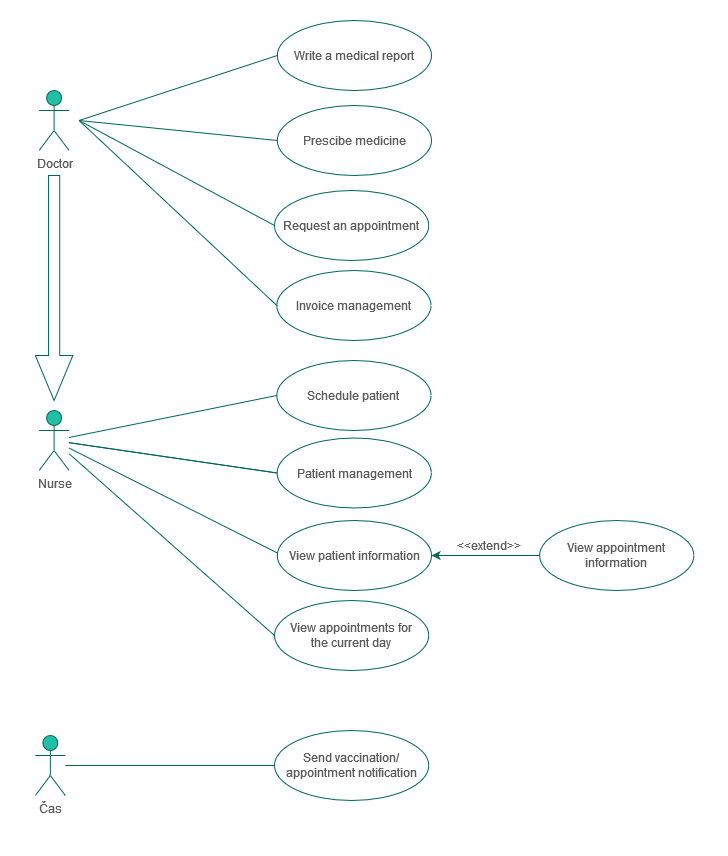

# General practitioner's office information system
## Overview

This Oracle SQL database is an information system for a general practitioner's office. The main purpose of this system is to maintain a database of patients and their conducted or planned examinations.

## Features

- **Patient Database**: Store information about patients, including the capability to handle foreign patients who may not have a national identification number.
- **Examinations**: Manage both planned and acute examinations, with detailed records of performed procedures, requests for specialized medical examinations, and prescribed medications.
- **Invoices**: Generate a maximum of one invoice per examination to document financial expenses.

## Data Model Description

### Patient Management
Patients can be both local and foreign. Foreign patients may not have a national identification number (NULL value), thus a special identification number is used as the primary key. Foreign patients are a specialized entity, requiring additional information for healthcare coverage purposes.

### Examination Management
Doctors handle both planned and acute cases, differentiated in the database by a boolean value ('ordered'). Each examination allows the recording of:

- Performed procedures (e.g., blood sample collection)
- Requests for specialized medical examinations (e.g., X-ray)
- Prescribed medications

### Invoice Management
Each examination can have at most one invoice to document the financial expenses incurred during the examination.

## Team members
- Michal Krulich
- Stanislav Letaši